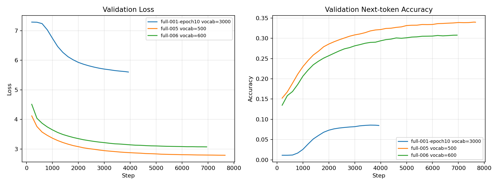
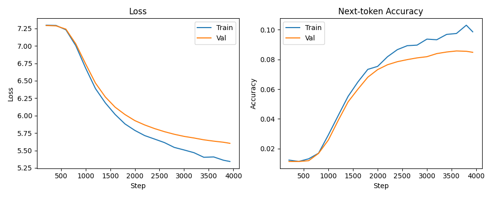
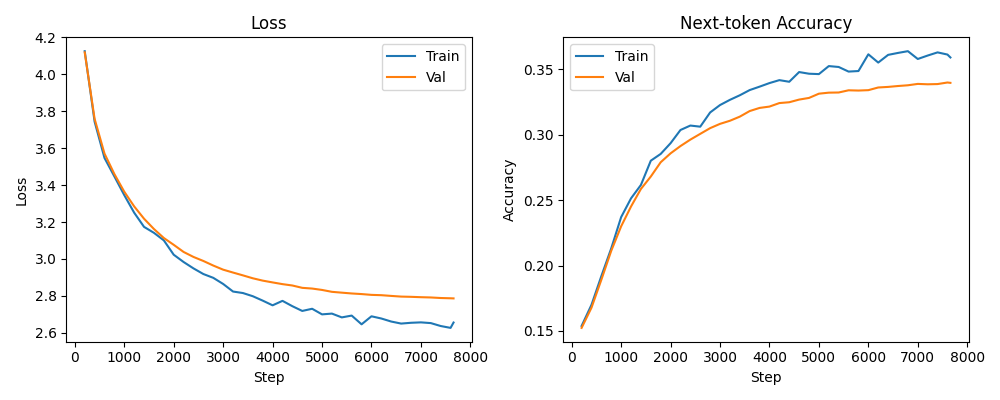
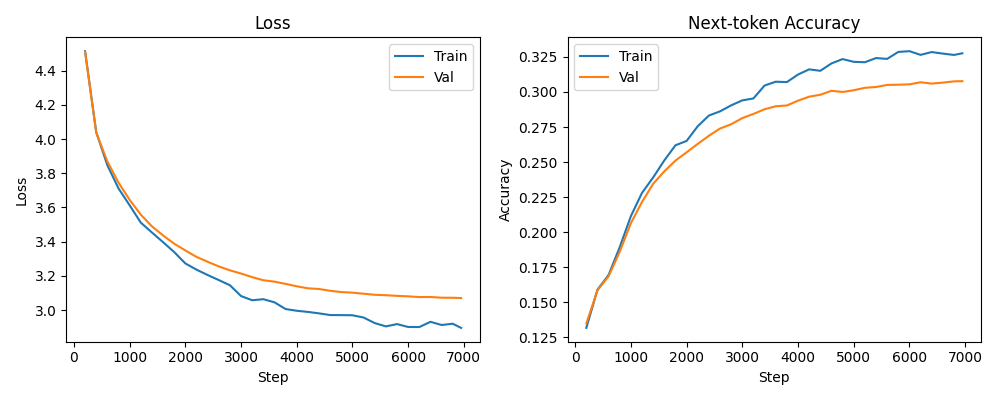
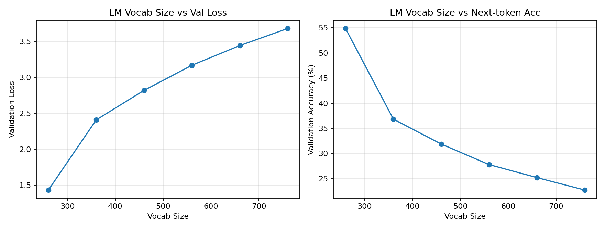
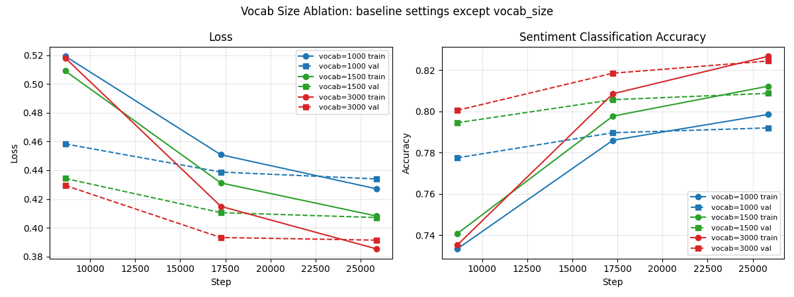

# mini GPT 구현 과제 보고서

## 0. 반·팀원

| 항목 | 내용 |
| --- | --- |
| 반 | 1반 |
| 팀명 | 3팀 |
| 팀원 | 김규민,백승민,김주형,김용 |

---

## 1. 구현 현황

| 단계 | 구현 내용 | 구현 파일 | 담당자 |
| --- | --- | --- | --- |
| 1 | UTF-8 byte-level BPE tokenizer | `src/bpe.py` |  |
| 2 | GPTDataset, create_dataloader, InputEmbedding | `src/dataset.py`, `src/embeddings.py` |  |
| 3 | MultiHeadAttention, causal mask | `src/attention.py` |  |
| 4 | LayerNorm, GELU, FeedForward, TransformerBlock, GPTModel, generate_text_simple | `src/model.py` |  |
| 5 | loss 계산, checkpoint, generate, train_model | `src/train.py` |  |
| 6 | NSMC 감성 분류 Dataset과 classifier | `src/finetune.py` |  |

---

## 2. 테스트 통과 현황

| 실행 명령 | 결과 | 비고 |
| --- | --- | --- |
| `pytest tests/test_bpe.py -v` | 통과 |  |
| `pytest tests/test_dataset.py -v` | 통과 |  |
| `pytest tests/test_attention.py -v` | 통과 |  |
| `pytest tests/test_model.py -v` | 통과 |  |
| `pytest tests/test_train.py -v` | 통과 |  |
| `pytest tests/test_finetune.py -v` | 통과 |  |
| `pytest tests/ -v` | 통과 |  |

---

## 3. 데이터

| 항목 | 내용 |
| --- | --- |
| 원본 데이터 | NSMC |
| 원본 경로 | `data/ratings_train.txt`, `data/ratings_test.txt` |
| 사전 학습 데이터 | `data/nsmc_lm_train.txt`, `data/nsmc_lm_val.txt` |
| 미세 조정 데이터 | `data/nsmc_sentiment_train.jsonl`, `data/nsmc_sentiment_val.jsonl`, `data/nsmc_sentiment_test.jsonl` |
| 전처리 방식 | 빈 리뷰 제거, 공백 정리, train/validation 분리 |
| 사용한 데이터 크기 | FULL |

---

## 4. BPE

| 항목 | 내용 |
| --- | --- |
| 구현 파일 | `src/bpe.py` |
| BPE 방식 | UTF-8 byte-level BPE |
| 특수 토큰 ID | `<pad>=0`, `<unk>=1`, `<bos>=2`, `<eos>=3` |
| byte token ID 범위 | 4~259 |
| vocab_size | 감성분류 1000/1500/3000, 지시형·생성 run 3000/500/600, LM 단일축 260/360/460/560/660/760을 비교했다. |
| 학습 corpus 크기 | corpus[:300_000] |
| 어휘 학습 시간 | tokenizer 학습만 따로 단독 측정하지 않았고, 각 실험 전체 실행 시간에 포함했다. |
| 인코딩/디코딩 복원 예시 | `decode(encode("이 영화는 좋았다")) == "이 영화는 좋았다"` 형태로 UTF-8 원문 복원이 가능하다. |

---

## 5. 모델 구조

| 항목 | 내용 |
| --- | --- |
| 구현 파일 | `src/model.py` |
| 전체 구조 | InputEmbedding -> 4 x TransformerBlock -> LayerNorm -> LM head |
| vocab_size | 3000 |
| context_length | 128 |
| emb_dim | 128 |
| n_heads | 4 |
| n_layers | 4 |
| drop_rate | 0.1 |
| qkv_bias | 설정값은 `False` |
| 총 파라미터 수 | 1,580,728개 |
---

## 6. 사전 학습

이번 프로젝트에서는 외부 OpenAI 사전학습 가중치를 사용하지 않았다. 대신 프로젝트 내부 GPT 구조를 NSMC 리뷰 텍스트에 대해 next-token prediction 방식으로 직접 학습했고, 이 next-token prediction 학습 자체가 곧 사전학습(self-supervised language modeling)에 해당한다. 아래 6.1·6.2는 `vocab_size`를 바꿔가며 이 사전학습의 loss/accuracy를 비교한 결과다.

다만 여기서 학습한 가중치를 7절 감성분류의 출발점으로 이어 붙이는 "사전학습 → 미세조정" 연결은 수행하지 않았다. 감성분류는 사전학습 checkpoint 없이 처음부터(from scratch) 학습했고, 실제로 감성분류 run의 `config.json`에서 `pretrain_run_dir`와 `checkpoint_path`가 모두 `null`로 기록되어 있다. 즉 6절(사전학습)과 7절(미세조정)은 가중치를 공유하지 않는 독립 실험이며, vocab_size(따라서 tokenizer)도 달라 가중치 호환 자체가 되지 않는다.  

### 6.1 지시형·생성 run vocab_size 비교

| Vocab Size | Run | Train Loss | Val Loss | Val Next-token Acc | 학습 결과 해석 |
| ---: | --- | ---: | ---: | ---: | --- |
| 3000 | `full-001-epoch10` | 5.3421 | 5.6026 | 0.0848 | 문장 연결이 불안정하고 underfit 경향이 큼 |
| 500 | `full-005` | 2.6560 | 2.7866 | 0.3397 | 세 조건 중 가장 낮은 loss와 가장 높은 next-token accuracy |
| 600 | `full-006` | 2.8957 | 3.0701 | 0.3077 | 500보다는 낮지만 3000보다 안정적 |

#### 개별 학습 곡선

대표 생성 run 비교에서는 `vocab_size=500`이 가장 좋은 결과를 보였다. next-token prediction은 매 위치에서 다음 token class를 맞히는 문제이므로, vocab이 작으면 예측해야 할 후보 수가 줄어 loss가 낮아지고 accuracy가 높아질 수 있다. 반대로 `vocab_size=3000`은 표현 가능한 token은 많지만 현재 데이터와 학습량에서는 class 수가 커져 underfit이 크게 나타났다.

### 6.2 LM vocab_size 단일축 비교

`context_length=128`, `batch_size=16`, `learning_rate=0.0003`, `epochs=5`, `emb_dim=192`, `n_layers=4`, `drop_rate=0.1`을 고정하고 `vocab_size`만 바꿔서 next-token loss와 accuracy 추이를 확인했다.

| Vocab Size | Steps | Train Tokens | Train Loss | Val Loss | Val Next-token Acc | Random CE |
| ---: | ---: | ---: | ---: | ---: | ---: | ---: |
| 260 | 8,140 | 3,335,336 | 1.4207 | 1.4334 | 54.85% | 5.561 |
| 360 | 4,780 | 1,957,976 | 2.3576 | 2.4081 | 36.83% | 5.886 |
| 460 | 4,025 | 1,649,300 | 2.7415 | 2.8183 | 31.88% | 6.131 |
| 560 | 3,600 | 1,475,106 | 3.0912 | 3.1674 | 27.79% | 6.328 |
| 660 | 3,320 | 1,360,565 | 3.3186 | 3.4404 | 25.21% | 6.492 |
| 760 | 3,110 | 1,275,815 | 3.5753 | 3.6777 | 22.74% | 6.633 |

LM 단일축 실험에서는 `vocab_size=260`이 validation loss 1.4334, next-token accuracy 54.85%로 가장 좋았다. vocab이 커질수록 validation loss는 증가하고 next-token accuracy는 감소했다. 이는 현재 데이터 크기와 5epoch 조건에서 작은 vocab이 class 수를 줄이고 token 수와 update step 수를 늘려 next-token 학습을 쉽게 만든 것으로 해석된다.

## 7. 미세 조정

7절은 사전학습 가중치를 사용하지 않고, GPT backbone 위에 분류 head를 붙여 NSMC 긍정/부정 감성을 직접 학습한 미세조정 실험이다. 앞 6절의 next-token 사전학습 run과는 가중치를 공유하지 않는 독립 실험이며, 여기서도 `vocab_size`를 바꿔가며 분류 성능을 비교했다.

### 7.1 감성분류 vocab_size 비교

| 항목 | 내용 |
| --- | --- |
| 구현 파일 | `src/finetune.py` |
| 과제 | NSMC 리뷰 긍정/부정 분류 |
| 데이터 포맷 | TSV 원본을 읽어 `text`, `label` 형태로 처리 |
| 비교 변수 | `vocab_size=1000`, `1500`, `3000` |
| max_length | 128 |
| batch_size | 16 |
| backbone learning rate | 0.0003 |
| classifier learning rate | 0.0003 |
| weight decay | 0.01 |

| Vocab Size | Experiment | Best Val Acc | Test Acc | Best Val Loss | Test Loss | 해석 |
| ---: | --- | ---: | ---: | ---: | ---: | --- |
| 1000 | `vocab_1000_baseline` | 0.7920 | 0.7955 | 0.4340 | 0.4363 | `max_length=128`에서 문장이 더 잘게 쪼개져 감성 단서가 잘릴 가능성이 크다. |
| 1500 | `vocab_1500_baseline` | 0.8087 | 0.8108 | 0.4071 | 0.4117 | 1000보다 개선됐지만 3000보다는 감성 단서 보존이 부족했다. |
| 3000 | `01_baseline` | 0.8244 | 0.8274 | 0.3914 | 0.3872 | 이번 감성분류 조건에서 가장 좋은 기준점이다. |

감성분류에서는 `vocab_size=3000`이 validation accuracy 0.8244, test accuracy 0.8274로 가장 좋았다. 감성분류는 다음 token 하나를 맞히는 문제가 아니라 문장 전체의 긍정/부정 단서를 모아 판단하는 문제다. 따라서 vocab이 너무 작으면 한국어 문장이 더 잘게 쪼개지고, `max_length=128` 안에서 중요한 감성 표현이 잘리거나 약해질 수 있다.

### 7.2 vocab_size 종합 비교

6절 사전학습(next-token)과 7절 미세조정(감성분류) 결과를 종합하면 다음과 같다.

- vocab size의 최적값은 하나로 고정되지 않고 task에 따라 달라진다.
- 감성분류(미세조정)에서는 `vocab_size=3000`이 가장 좋았다. 감성분류는 문장 전체의 의미와 감성 단서를 보존하는 것이 중요하므로, 너무 작은 vocab은 표현을 지나치게 쪼개고 `max_length=128` 안에서 중요한 단서를 약화시킬 수 있다.
- 지시형·생성 run(사전학습)에서는 `vocab_size=500`이 가장 좋았다. next-token prediction은 매 위치에서 다음 token 후보 중 하나를 맞히는 문제라서, 현재 데이터와 학습량에서는 작은 vocab이 class 수를 줄여 더 안정적으로 수렴했다.
- LM 단일축 실험(사전학습)에서는 `vocab_size=260`이 가장 좋은 loss와 accuracy를 보였다. 다만 이는 next-token accuracy 기준의 결과이며, 감성분류처럼 의미 단서 보존이 중요한 task에 그대로 적용하면 성능이 떨어질 수 있다.
- 따라서 이번 실험에서 적절한 vocab size는 감성분류 기준으로는 3000, 생성/next-token 학습 기준으로는 260~500 범위로 해석할 수 있다.

---

## 8. 실험 환경

| 항목 | 내용 |
| --- | --- |
| Python | Python 3.12.12 |
| PyTorch | PyTorch 2.12.0 |
| 실행 환경 | 로컬 |
| GPU/CPU 정보 | CPU 기준 실행, CUDA 사용 안 함 |
| 비고 | 일부 환경에서 MPS 사용 가능하지만, 보고서 결과는 로컬 CPU 기준으로 정리 |

---

## 9. 고찰

### 어려웠던 점

Basic/Full 데이터 기준으로 실험을 진행하니 tokenizer 학습과 encode 과정이 예상보다 오래 걸렸다. 특히 vocab size를 바꿔가며 여러 실험을 반복할 때, 매번 BPE tokenizer를 다시 학습하고 train/validation/test 데이터를 다시 encode하면 실제 모델 학습보다 전처리 시간이 큰 부담이 되었다. 이 때문에 하이퍼파라미터를 많이 바꿔가며 실험하기가 쉽지 않았다.

### 개선 시도

감성분류 이후 다른 실험을 할때는 반복해서 사용되는 tokenizer와 encode 결과를 저장해 재사용하는 방식으로 실험 시간을 줄이려 했다. 예를 들어 같은 vocab size와 같은 데이터 split을 사용하는 경우 tokenizer를 다시 만들지 않고 저장된 tokenizer를 불러오고, 이미 encode한 데이터는 cache처럼 활용할 수 있도록 정리했다. 이를 통해 모델 구조나 학습 설정을 바꿀 때마다 동일한 전처리를 반복하는 낭비를 줄일 수 있었다.

### 한계

이번 실험은 vocab size를 중심으로 비교했지만, 모든 하이퍼파라미터 조합을 체계적으로 탐색하지는 못했다. 예를 들어 context length, layer 수, embedding dimension, learning rate, batch size 등을 vocab size와 함께 조합하면 훨씬 많은 경우가 생기는데, 로컬 환경에서 Basic/Full 데이터 전체를 기준으로 모두 실행하기에는 현실적으로 시간이 부족했다. 따라서 이번 결과는 가능한 모든 설정 중 최적값을 찾은 것이라기보다, 제한된 조건에서 vocab size가 task별로 다르게 작용한다는 경향을 확인한 실험으로 해석해야 한다.

### 배운 점

이번 실험을 통해 vocab size는 단순히 크면 좋은 값이 아니라 task와 평가 기준에 따라 다르게 작용한다는 점을 확인했다. 감성분류에서는 문장 의미와 감성 단서 보존이 중요해 큰 vocab이 유리했고, next-token 예측에서는 작은 vocab이 예측 class 수를 줄여 더 안정적으로 학습되는 경향을 보였다.
